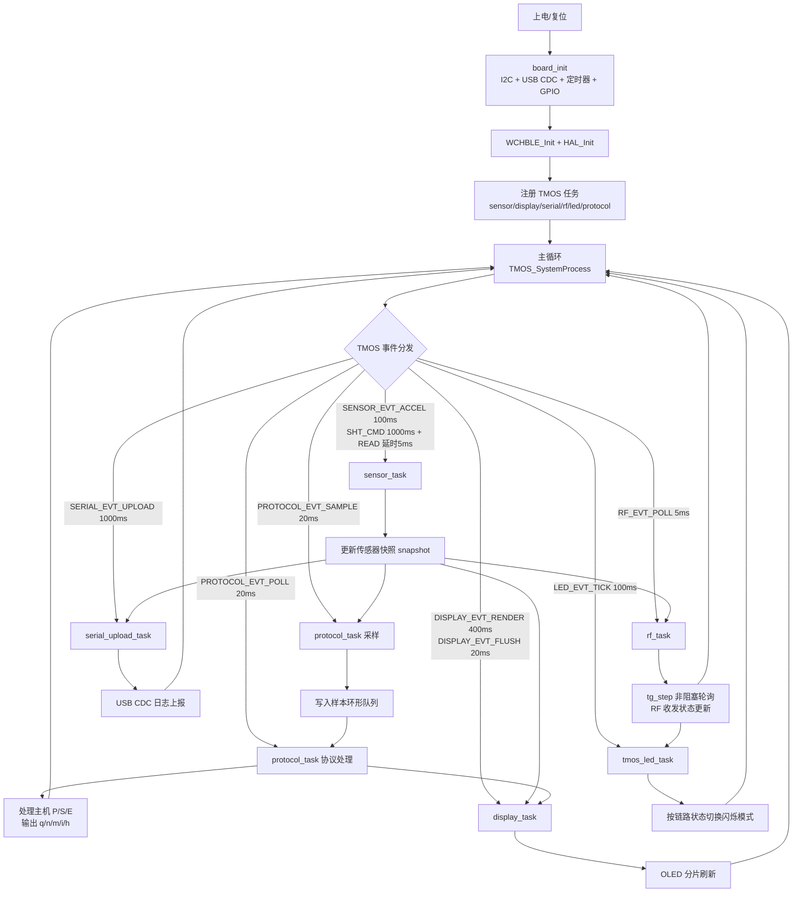
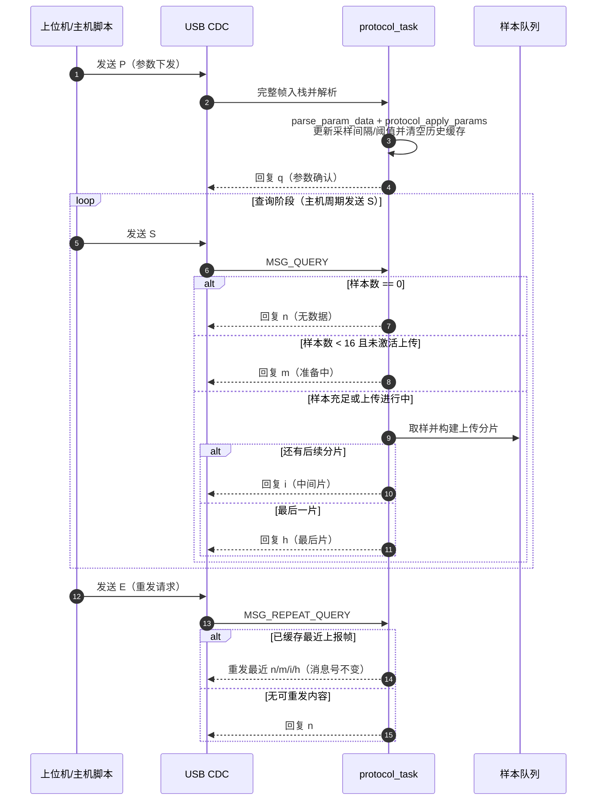

# CH32V208 TMOS CDC 工程说明

## 1. 项目简介
本工程基于 **CH32V208**，使用 **TMOS** 进行任务调度，当前已实现：
- SC7A20 三轴加速度采集
- SHT40 温湿度采集（两段式）
- OLED 状态显示（小字号 6x8）
- USB CDC 串口上报任务（原有日志）
- AROS-RF 射频任务 `rf_task`（`tag.c` TMOS 非阻塞状态机）
- 协议任务 `protocol_task`（`P/q`、`S/E`、`n/m/i/h`）
- I2C 总线仲裁与 IT/DMA 混合传输
- HAL 层 `KEY/LED` 模块已从工程编译链路移除（LED 指示由 `tmos_led_task` 负责）

主入口位于 [app/main.c](app/main.c)，初始化顺序如下：
1. `board_init()`
2. `WCHBLE_Init()`
3. `HAL_Init()`
4. `sensor_task_init()`
5. `display_task_init()`
6. `serial_upload_task_init()`
7. `rf_task_init()`
8. `led_task_init()`
9. `protocol_task_init()`
10. `while(1) { TMOS_SystemProcess(); }`

## 1.1 业务流程图（系统视角）


## 1.2 协议交互时序图（主机业务流程）


## 2. 当前任务与频率
### 2.1 传感器任务（sensor_task）
文件：`app/tasks/sensor_task.c`
- SC7A20：**400 Hz** 采样（2.5 ms）
- SHT40：**1 Hz** 采样（1000 ms）
- SHT40 采用两段式事件：
  - 第一步发送测量命令
  - 延时后第二步读取结果
- 使用快照结构共享数据，供显示任务、日志任务、协议任务读取
- 新增碰撞位移算法支持（impact_displacement）

### 2.2 协议任务（protocol_task）
文件：`app/tasks/protocol_task.c`
- 轮询周期：**20 ms**
- 样本采集节拍：**20 ms Tick + 参数化间隔（默认 100 ms）**
- 支持协议：
  - 主机->设备：`P`、`S`、`E`
  - 设备->主机：`q`、`n`、`m`、`i`、`h`
- 语义：
  - `P`：设置参数并回 `q`
  - `S`：按状态回 `n/m/i/h`
  - `E`：重发上一个上报帧（消息号不变）

### 2.3 显示任务（display_task）
文件：`app/tasks/display_task.c`
- 渲染周期：**400 ms**
- 分片刷屏周期：**20 ms**（每次刷新 32x8 小块，降低单次 I2C 占用）
- 字号：**`OLED_6X8` 小字**
- 显示内容（8 行）：
  1. `TG/RF/A/S`：`tg_id`、RF 同步标志、`AHz/SHz`
  2. `RFTX/RFRX`：RF 发包/收包累计计数
  3. `A:x,y,z`：三轴加速度（mg）
  4. `T/H`：温度与湿度
  5. `TX/SQ/Q`：协议最近发包类型、序号、`q` 包计数
  6. `UP`：上传状态、分片进度、超阈值标志
  7. `TH/A`：阈值范围与当前加速度 12bit 值
  8. `N/M/I/H`：各类上报帧累计计数
- UI 字符串模板（逐行）：
```text
1. TG:%u RF:%u A:%u S:%u
2. RFTX:%lu RFRX:%lu
3. A:%ld,%ld,%ld
4. T:%ld.%02ld H:%ld%%
5. TX:%c SQ:%u Q:%u
6. UP:%u %u/%u O:%u
7. TH:%u-%u A:%u
8. N:%u M:%u I:%u H:%u
```
- UI 显示示例（逐行）：
```text
1. TG:1 RF:1 A:10 S:1
2. RFTX:209 RFRX:172
3. A:947,7,240
4. T:33.12 H:23%
5. TX:h SQ:12 Q:34
6. UP:1 8/64 O:0
7. TH:500-1500 A:923
8. N:20 M:5 I:12 H:18
```

### 2.4 串口日志任务（serial_upload_task）
文件：`app/tasks/serial_upload_task.c`
- 上报周期：**1 s**
- 每秒打印最近一次：
  - 加速度数据
  - 温湿度数据
  - 统计信息（`accel_hz/sht_hz/sht_ok/sht_err/ready`）

### 2.5 射频任务（rf_task）
文件：`app/tasks/rf_task.c`
- 基于 `lib/AROS-RF-LIB/src/tag.c` 的 `tg_step()` 非阻塞状态机
- 轮询周期：**5 ms**（TMOS 事件驱动，不使用 while 阻塞等待 slot）
- 数据通过 `tg_set_newdatfunc()` 注入 `MSG_DAT(24B)`（传感器快照）
- 发送接口使用 `arf_TxTrySend()`（非阻塞入队）
- 串口日志增加 `sync` 字段，表示当前是否完成时隙同步
- `tg_id` 由构建选项 `rf_tg_id` 注入（范围 0~20）

### 2.6 链路指示灯任务（tmos_led_task）
文件：`app/tasks/tmos_led_task.c`
- 轮询周期：**100 ms**
- 当 RF 未建立双向通信（无持续接收）时：LED 每 **1 秒闪烁一次**
- 当 RF 通信建立后（`sync=1` 且持续收到对端包）时：LED 进入**快速闪烁**

## 3. I2C 与 OLED 说明
### 3.1 I2C 架构
- 底层驱动：`bsp/drivers/src/drv_i2c.c`
- 仲裁层：`bsp/bus/src/i2c_bus_arbiter.c`
- OLED、SC7A20、SHT40 都通过仲裁层提交 I2C 请求

### 3.2 OLED 寻址模式（可选）
文件：`lib/oled/OLED.h`
- `OLED_ADDR_MODE_HORIZONTAL` = `0`
- `OLED_ADDR_MODE_PAGE` = `2`
- 当前默认：
  - `#define OLED_ADDR_MODE OLED_ADDR_MODE_PAGE`


## 4. 协议与UI说明文档
- 协议实现指导：`数贸Demo.txt`
- UI 与协议字段速查：`docs/PROTOCOL_UI.md`
- 主机自动联调脚本：`scripts/protocol_host_tester.py`

## 5. 构建与运行
### 5.1 构建
```bash
xmake -r
```

### 5.2 构建选项
- 关闭运行日志：
```bash
xmake f --log_print=false
xmake -r
```
- 打开运行日志：
```bash
xmake f --log_print=true
xmake -r
```
- 配置当前设备 `tg_id`（示例：5）：
```bash
xmake f --rf_tg_id=5
xmake -r
```

### 5.3 串口查看（USB CDC）
示例：
```bash
python scripts/serial_reader.py --port COM8 --baud 115200 --encoding utf-8
```
单次读取：
```bash
python scripts/serial_reader.py --port COM8 --baud 115200 --encoding utf-8 --once
```

### 5.4 协议自动联调（P/S/E）
说明：`scripts/protocol_host_tester.py` 会按协议格式发送 `P` / `S` / `E` 并打印回包校验结果。

先安装依赖（若未安装）：
```bash
pip install pyserial
```

典型用法（COM4）：
```bash
python scripts/protocol_host_tester.py --port COM4 --send-params --query-count 6 --send-repeat
```

仅查询（只发 `S`）：
```bash
python scripts/protocol_host_tester.py --port COM4 --query-count 10
```

若偶发超时，建议增加启动等待与重读次数：
```bash
python scripts/protocol_host_tester.py --port COM4 --send-params --query-count 10 --startup-delay 1.0 --read-retries 2 --read-retry-gap 0.08
```

## 6. 目录概览（当前）
- `app/`：应用入口与任务
- `bsp/`：板级初始化、驱动、I2C 仲裁、USB CDC
- `lib/oled/`：OLED 驱动与字库
- `lib/sc7a20/`：加速度计驱动
- `lib/sht40/`：温湿度驱动
- `lib/AROS-RF-LIB/`：AROS-RF 射频协议栈
- `sdk/`：CH32 SDK/HAL/外设库
- `utils/`：公共工具（含 `data_protocol`）
- `scripts/`：构建与串口辅助脚本
- `docs/`：补充说明文档

## 7. 注意事项
- 本工程文本文件统一建议使用 **UTF-8**。
- 在使用终端工具或其他自动化工具前，必须先确保输入与输出均为 **UTF-8** 编码（包括命令输出、日志、脚本读写文件）。
- PowerShell 推荐先执行：`chcp 65001`、`[Console]::InputEncoding = [System.Text.UTF8Encoding]::new($false)`、`[Console]::OutputEncoding = [System.Text.UTF8Encoding]::new($false)`。
- 若终端显示乱码，请确认终端编码与文件编码一致。
- OLED 寻址模式切换后，建议重新上电并观察一段时间，确认显示稳定。

## 8. 拓展提示
1. 新增 I2C 设备统一走仲裁层。
2. 任务间数据共享统一走快照接口。
3. 日志输出统一走 `LOG_PRINT` 宏，便于整体开关。
4. wchble.h 里有不少类似标准库函数，可以减小二进制大小。
