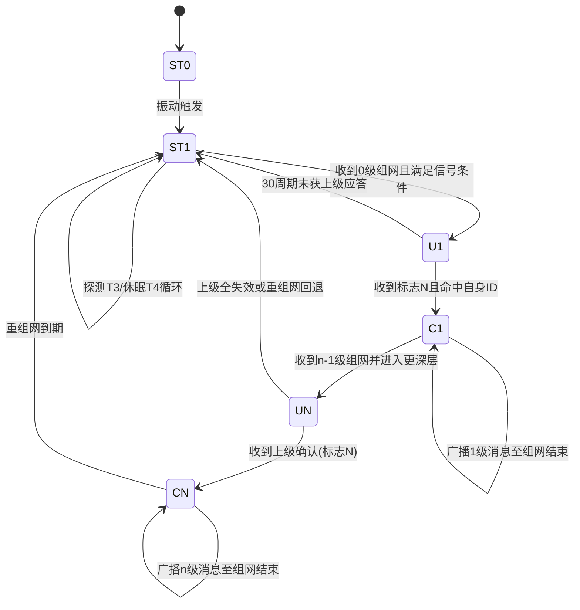
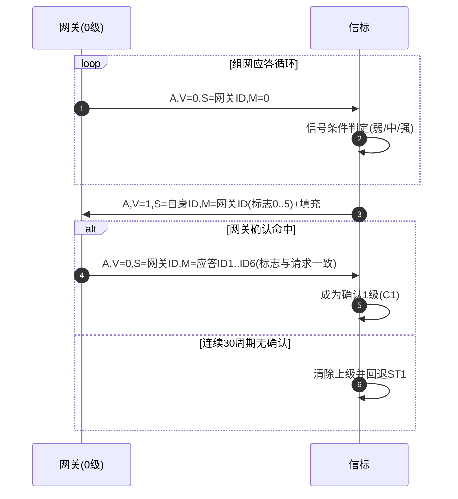
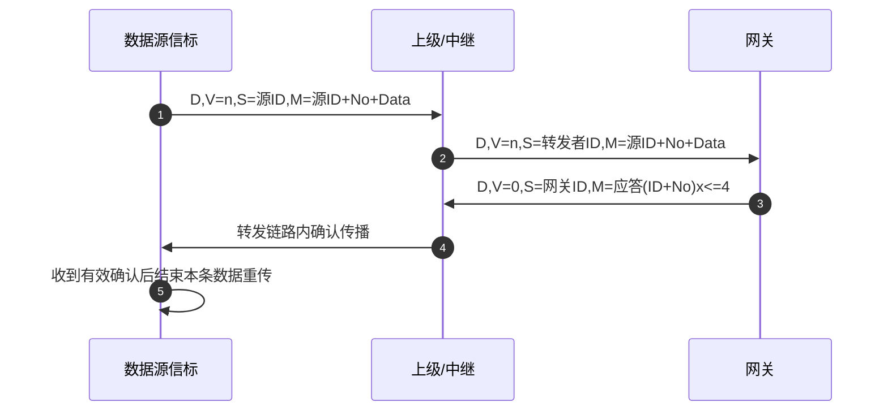

# 智能巡查系统自组网协议设计文档（修订草案 v2）

## 1. 文档定位与规范优先级

### 1.1 文档定位

本文档用于约束本仓库自组网协议的架构和实现边界，指导后续编码与评审。  
本轮目标是将协议细节明确为“规范条款”，避免实现偏离。

### 1.2 规范优先级（强制）

后续设计与实现必须遵循以下优先级：

1. `docs/智能巡查系统自组网协议-003.pdf`（最高优先级，协议细节唯一准绳）
2. 本文档（工程化落地约束）
3. 其他说明文档（README、历史草稿、示例代码等）

如出现冲突，必须按上述顺序裁决；不得以历史实现覆盖 `003.pdf`。

### 1.3 本次固定约束

1. 新协议实现位置固定在 `lib/Ad-Hoc-lib/`。
2. 不在 `lib/AROS-RF-LIB/` 内直接实现或改造协议逻辑。
3. 必须实现链路层与协议层解耦，保证协议可迁移到其他链路与平台。
4. 现有任务保留用于参考，不删除；新链路默认不依赖旧任务主路径。

## 2. 角色与目标范围

### 2.1 业务目标

实现网关与信标的无线自组网通信，覆盖：

- 低功耗休眠与唤醒
- 分级组网、多跳中继
- 组网后数据上报、转发、确认与去重

### 2.2 节点角色

- 网关：发起组网、维护拓扑、应答数据、上送平台。
- 信标：休眠唤醒、加入网络、采集与上报、必要时中继。

本阶段按“信标侧优先”推进，但接口必须同时支持网关/信标两角色。

## 3. 协议硬约束（来自 003.pdf）

本章条款均视为“必须（MUST）”。

### 3.1 时隙与周期参数

- `T1`：时隙宽度，应为 TMOS 定时间隔 `625us` 的整数倍。
- `T2`：接收窗口时长。
- `T5 = T1 + T2`：一个应答周期。
- `n = T5 / T1`：一个应答周期内的时隙数。
- `T3`：组网探测时间，且必须满足 `T3 > T5`。
- `T4`：组网探测休眠等待时间。
- `T6 = T3 + T4`：组网探测周期。
- `m = T6 / T3`：组网等待倍数，建议区间 `10 ~ 1000`。

`003.pdf` 暂定值：

- `T1=2.5ms`
- `T5=60ms`
- `n=24`
- `T3=62.5ms`
- `T6=2000ms`
- `m=32`

### 3.2 报文通用格式

统一格式：

- `消息类别+网关号+时隙号`：`1B`
- `级别 V`：`1B`
- `发送者 S`：`5B`
- `内容 M`：`24B`
- `CRC8`：`1B`

总长固定为 `32B`。

### 3.3 字段语义（位级）

#### 3.3.1 第 1 字节（消息类别+网关号+时隙号）

- bit7：消息类别，`0=A(组网消息)`，`1=D(数据消息)`。
- bit6..bit4：网关号，`0..7` 循环使用。
- bit3..bit0：时隙号（当前应答周期中的位置序号高 4 位）。
- 时隙号最低位必须与级别 `V` 最低位同奇偶（单双数级别分离，减少相邻级冲突）。

#### 3.3.2 级别 `V`

- `1B`，表示节点自组网级别。

#### 3.3.3 发送者 `S`

- `5B`，高 `11bit` 为域号，低 `29bit` 为 ID。
- 以 `1000000` 为界：
  - `1..1000000`：网关 ID
  - `1000001` 及以上：信标 ID
- `ID != 0`。
- 收包方必须先做域号一致性检查；非本域消息直接丢弃。

#### 3.3.4 内容 `M`

- 固定 `24B`，不足时补 `0`。
- 内容中涉及 ID 时使用 `4B` 表示：
  - 高 `3bit`：ID 标志
  - 低 `29bit`：域内 ID

#### 3.3.5 `CRC8`

- 覆盖范围：`消息类别+网关号+时隙号`、`V`、`S`、`M`。

### 3.4 ID 标志语义

- `0..5`：未确认下级发给上级的回应（值表示下级对上级编号）。
- `6`：已确认下级发给上级的回应（可忽略）。
- `7`：保留为广播类标志（可用于兼容/通知），不作为“未确认节点转确认态”的判定依据。

## 4. 状态机与流程约束（协议细节）

### 4.1 信标状态定义

- `ST0`：深度休眠（出厂到投入使用前），库存待机目标 `T0 >= 1年`。
- `ST1`：等待组网，执行“接收探测 `T3` + 休眠 `T4`”循环。
- `ST2` 及 `STn`：组网进行态（包含未确认/已确认成员子状态）。

当前实现命名映射（`2026-04-25`）：

- 代码中将“组网进行态”拆分为 `U1/UN/C1/CN` 四个显式状态，分别表示“未确认 1 级 / 未确认 n 级 / 已确认 1 级 / 已确认 n 级”。
- `ST0` 当前仅保留为规范概念，尚未进入运行态控制；任务启动后默认从 `ST1` 进入协议流程。

### 4.2 网关组网应答循环

网关必须按统一时统在约定 `0` 时隙发射 `0` 级组网消息并接收 `T2`：

- 发送格式：`A V=0 S=网关ID M=0填充 C8`
- 周期重复直到本轮组网时间结束。

当前实现对齐说明（`2026-04-26`）：

- `Ad-Hoc-lib` 已实现网关按 `T5` 周期发射 `A V=0`，并在发射后开启 `T2` 收集窗口。
- 网关侧已加入独立 `network_window_us` 时间窗控制；当前工程默认 `30s` 到期后自动停发。
- 信标侧“与网关统一结束时刻”仍需按 `003.pdf` 继续收口，当前不能把该条误判为全量完成。

### 4.3 1 级组网（必须行为）

1. 信标收到 `0` 级组网消息后，按信号强度条件判定是否成为“未确认 1 级”：
   - 弱/无：后续 `4` 个应答周期至少成功收到 `2` 个组网消息
   - 中：后续 `2` 个应答周期至少成功收到 `1` 个组网消息
   - 强：无需后续检测
2. 成为未确认 1 级后，记录网关 ID，随机选时隙发送回应：
   - `A V=1 S=自身ID M=收到的网关ID(4B)+0(20B) C8`
   - 该网关 ID 的 ID 标志取 `0..5`（通常 `0`）
3. 回应最多连续发送 `30` 个应答周期，直到收到上级应答：
   - 若 `30` 次未收到应答，清除上级标记并回退 `ST1`
4. 网关收到回应后：
   - 若不含本网关 ID，丢弃
   - 若 ID 标志为 `6`，忽略
   - 若 ID 标志 `0..5`，记录下级并在后续 `0` 时隙发确认消息
5. 网关确认消息格式：
   - `A V=0 S=网关ID M=应答ID1+...+应答ID6 C8`
   - 单帧最多应答 `6` 个下级，不足补 `0`
6. 信标收到确认后，仅当命中自身 ID 且标志等于本次回应所用 `Flag=N` 时，转为“确认 1 级”。
   - 若收到 `Flag=M`（`M≠N`）或 `Flag=7`，不得转入确认态。
7. 确认 1 级信标需持续广播 1 级组网消息直到组网时间结束，用于拉起 2 级。

当前实现对齐说明（`2026-04-26`）：

- 网关侧已加入 `network_window_us`（当前默认 `30s`）组网时间窗：时间窗结束后停止 `A V=0` 发射，并同步关闭 `T2` 收集窗口。
- 信标侧当前采用“首次观测该上行方向时，记录本地方向结束时刻并继承到已确认态”的轻量实现：窗口到期后停止继续广播该级组网消息，进入锁定停发。
- 由于当前 `A` 帧未扩展显式“绝对结束时刻”字段，上述结束时刻仍是本地观测时间，不等同于全网统一绝对时刻；后续阶段再按 `003.pdf` 继续收口。
- 对 `docs/t07任务约束` 的评估结论是：其“在 `A` 帧 `payload[0..3]` 固定注入 `4B Epoch`”方案会直接压缩当前 `6` 条确认布局，因而不适合在当前主协议上直接落地；详见 `docs/t07任务约束评估.md`。
- 已完成单板网关路径板测：串口 `adhoc sm` 可观测 `gw_left/gw_lock/gw_start`，实测 `gw_lock` 会在约 `30s` 后由 `0` 变为 `1`，同时发包计数停止增长。
- 当前仅有单板，信标侧“方向结束时刻到期锁定”、`3*T5` 上级失效回退、多网关方向锁定等条目仍需后续双板/多板继续验证。
- 已完成首轮双板验证：板2信标可从 `ST1` 进入 `C1`（`lvl=1`、`up_id=1`、`net_act=1`），且 `adhoc data ack` 持续增长，说明最小入网与数据上报确认闭环已跑通。
- 同一轮中板2又回退到 `ST1`（`up_id=0`、`net_act=0`）；结合当前实现，这与“连续 `3*T5` 未再收到当前上级 `A` 帧则显式回退”一致，但是否由网关时间窗结束触发，仍需后续同步板1侧观测进一步确认。
- 已补做双串口复核：板1 `COM8` 侧确认 `role=GW`、`gw_lock=1`，且链路层统计呈现 `tx=16 / tx_req=477 / busy=461`。这说明当前双板回退现象更偏向“网关侧有效广播过稀、触发上级失效回退”，而不是 `T07` 状态机逻辑缺失。

### 4.4 n 级组网（n>=2）

`003.pdf` 要求 n 级流程与 1 级流程同构（将网关视作 0 级）：

- 未监听到组网消息的信标收到 `n-1` 级组网消息并满足信号条件后，成为未确认 `n` 级。
- 响应消息：
  - `A V=n S=自身ID M=回应/应答ID1..ID6 C8`
- 每个上级的回应最多连续发送 `30` 个应答周期。
- 上级对下级确认采用“应答列表 + 定向 `Flag(0..5)`”语义，确认位应与下级回应位一致。
- 单帧最多应答 `6` 个下级，超出分组，不足补 `0`。
- 确认 `n` 级后持续广播 `n` 级组网消息，启动 `n+1` 级。

在并行“回应新上级 + 应答下级”场景下：

- 若当前无下级应答，回应新上级消息中第一个 ID 应为“标志 `6` 的已确认上级”，用于保证下级识别链路合法性。

### 4.5 多网关取舍

- 信标可收到多个网关方向的组网请求时，应优先选择“信号强且级别低”的方向。
- 一旦响应某网关方向，后续只响应该方向消息，其余网关方向消息全部放弃。

当前实现对齐说明（`2026-04-26`）：

- 已实现轻量邻居表 `Top-K Cache`（当前 `K=6`）：缓存 `gateway_no/upstream_level/upstream_id/最近RSSI/命中周期`，不再依赖单一 `candidate` 覆盖更新。
- 候选优选规则为：先比信号档位（强/中/弱），再比最近 `RSSI`，再比低级别、低 `gateway_no`、低上级 ID。
- 缓存满时仅允许“更优候选”替换当前最差项；这是为静态内存与 `0..5` 上级编号容量约束采用的轻量实现。
- 已确认后的发包路径固定沿已选上行 `gateway_no` 发送；对子级组网请求也仅处理与当前 `upstream_gateway_no` 一致的方向。
- 已确认节点在当前实现中会继承“首次观测该方向”的本地 `network_end_us`，到期后仅锁定停发，不再继续拉起下级。
- 已加入轻量“上级失效回退”判定：当未结束组网窗口内连续超过 `3*T5` 未再听到当前上级的 `A` 帧时，节点显式回退 `ST1` 并释放方向锁定。
- 当前锁定释放条件收束为：`上级失效显式回退 ST1`、`重组网到期回退 ST1`、`人工复位/切角色`。
- “全网统一结束后的最终锁定语义”仍按 `T07` 继续收口，当前文档不得将其视为已完整完成。
- 若未来确需“全网统一绝对结束时刻”显式传播，必须先完成协议层裁决：要么接受 `A` 帧确认容量下降，要么扩展协议壳子；在此之前不直接修改当前 `A` 帧布局。

### 4.6 重新组网

- 组网完成后可设置重组网时间。
- 到期后信标必须清空原组网记录并回退 `ST1`。

当前实现对齐说明（`2026-04-26`）：

- 库内已加入独立的重组网本地计时接口 `regroup_interval_us`；启用后从“本节点进入确认态”的时刻开始计时，到期回退 `ST1`。
- 当前工程默认仍关闭该计时器（`0`），避免在全网统一结束时刻尚未完全对齐前误判协议已收口。
- 因此，当前实现属于“本地回退骨架已具备”，但仍不等同于 `003.pdf` 所要求的“全网统一组网完成后的重组网策略”最终版本。
- 在重组网计时未开启前，若节点在未结束组网窗口内连续 `3*T5` 未听到当前上级，则同样视作“上级全失效”并显式回退 `ST1`。

### 4.7 数据传输与应答

#### 4.7.1 数据消息格式

- `D V=n S=自身ID M=数据源ID(4B)+No(2B)+数据(18B) C8`

#### 4.7.2 去重规则

- `数据源ID + No` 构成数据唯一标识。
- 上级/中心收到相同标识数据应合并去重。
- 文档建议 6 小时窗口去重以规避 No 重用影响。

#### 4.7.3 原发与转发判定

- `发送者ID == 数据源ID`：原发数据。
- 否则：转发数据。

原发数据：

- 数据源 ID 标志表示“可接收并转发该数据的最大上级编号”。
- 数据源收到任一上级转发即视为已发送，否则重发。

转发数据：

- 数据源 ID 标志表示“可再转发的上级编号”。
- 收到任一再转发即视为已转发，否则重发。

当前实现对齐说明（`2026-04-25`）：

- 当前 `adhoc_data_plane` 已实现“原发/转发判定”“`ID+No` 去重”“转发重试”“网关 ACK 命中清理”。
- 当前版本已按 `source.node_id + No` 作为去重/ACK 命中键，不再把随转发变化的 `id_flag` 计入唯一标识。
- 当前版本已在转发路径区分“原发/转发”两类语义：原发数据在首次转发时改写为“再转发上级编号”，转发数据仅在 `id_flag` 命中本节点可再转发上级编号时继续上送。
- 当前版本已支持“监听确认”：源节点监听到任一上级转发、转发节点监听到任一再转发后，均停止本条数据继续重发。
- 当前版本的 `D` 帧转发级别、网关号与上级编号均由组网状态机快照同步到数据面；`upstream_no` 已由状态机内的上级编号绑定表（`0..5`）分配，数据面不再自行硬编码该值。
- `source_id_flag` 的“多编号”基础已与 `Top-K Cache + upstream_no` 绑定联动，但完整语义仍依赖 `T07` 后续把“锁定释放/全网结束/更细粒度多上级策略”全部收口。

#### 4.7.4 网关数据应答

- 网关应答格式：
  - `D V=0 S=网关ID M=应答ID1+No1,应答ID2+No2,应答ID3+No3,应答ID4+No4 C8`
- 单帧最多同时确认 `4` 个数据消息。
- 收到网关应答后，对应数据传输完成。

## 5. 工程落地架构（与协议细节解耦）

### 5.1 当前工程基线（As-Is）

`2.4G_RF` 当前具备 TMOS 多任务和 AROS-RF 示例链路：

- `app/main.c` 注册了传感器、显示、串口、RF、协议、LED 等任务。
- `app/tasks/rf_task.c` 当前基于 `lib/AROS-RF-LIB/src/tag.c` 调用。

这些现有任务与实现保留供参考，不删除。

### 5.2 分层原则（To-Be）

协议栈分为四层：

1. 业务层（App）
2. 协议层（Ad-Hoc Protocol）
3. 链路抽象层（Link Adapter Interface）
4. 链路实现层（当前可接 AROS-RF，未来可替换）

层间限制：

- 协议层不得直接依赖 `TMOS`、`WCHBLE`、`board`、`RF_*`。
- 链路实现层不得承载 ST 组网决策。
- 业务层通过协议公开 API 交互。

### 5.3 目录规划

- `lib/Ad-Hoc-lib/include/`：协议公共类型、编解码与状态机 API、链路抽象接口。
- `lib/Ad-Hoc-lib/src/`：协议实现（组网、路由、去重、重传）。
- `lib/Ad-Hoc-lib/port/ch32v208/`（建议）：平台时间/随机数/临界区适配。
- `port/ch32v208` 随机源优先复用 TMOS 提供的标准库实现（`rand/srand`），避免重复维护自定义 PRNG。
- `app/adapters/`（建议）：AROS-RF 到链路抽象接口的桥接实现。

`lib/AROS-RF-LIB/` 仅作为链路后端，不放新协议代码。

### 5.4 链路抽象接口（草案）

```c
typedef struct {
    int (*init)(void *ctx);
    int (*start_rx)(void *ctx);
    int (*tx)(void *ctx, const uint8_t *buf, uint16_t len);
    int (*poll_rx)(void *ctx, uint8_t *buf, uint16_t *len, int8_t *rssi);
    uint32_t (*now_us)(void *ctx);
    uint16_t (*rand_u16)(void *ctx);
} adhoc_link_ops_t;
```

### 5.5 协议层 API（草案）

本节仅用于说明“协议层 API 必须存在并独立于链路层”。  
具体函数签名、返回码、版本策略以 **第 13 节 `Ad-Hoc-lib` 最小 API 冻结版本（v0.1）** 为唯一准则。

## 6. 任务组织策略（项目内）

1. 新自组网主流程收敛到单一 `ad_hoc_task`（名称可调整）。
2. 其他旧任务保留不删除，默认不参与新链路主流程。
3. 采用新链路为默认主路径；旧任务保留但不参与主流程，避免双链路并行导致状态冲突。

## 7. 分阶段计划（不写实现细节）

### 阶段 A：规范冻结

- 逐条锁定 `003.pdf` 条款映射关系。
- 冻结 `Ad-Hoc-lib` 模块边界与层间依赖规则。

### 阶段 B：骨架接通

- 建立 `Ad-Hoc-lib` 协议骨架与 CH32 端口骨架。
- 打通 `ad_hoc_task -> link adapter -> AROS-RF` 最小链路。

### 阶段 C：协议能力递进

- 先信标端 ST1/ST2/n 组网主路径。
- 再扩展网关应答、多网关取舍、重组网。
- 最后完善数据转发、去重、重传与网关应答。

### 阶段 D：验证回归

- 协议层以主机仿真与单元测试为主。
- 板级重点验证时隙稳定性、功耗、丢包恢复能力。

## 8. 架构验收标准

1. 新协议源码位于 `lib/Ad-Hoc-lib/` 及其适配目录。
2. 协议核心不含平台驱动头文件依赖。
3. AROS-RF 仅通过链路适配接口调用，不直接嵌入协议状态机。
4. `003.pdf` 关键条款（时隙、报文、状态机、应答数量）都有实现映射。
5. 任务策略满足“新主任务收敛 + 旧任务保留不删除”。

## 9. 一致性核对清单（编码前必过）

对应的工程化验证映射见：`docs/验证与回归清单.md`。

- [ ] 时隙参数关系满足：`T5=T1+T2`、`T6=T3+T4`、`n=T5/T1`、`m=T6/T3`。
- [ ] 报文固定 `32B`，字段长度与 CRC8 覆盖范围正确。
- [ ] `A/D` 消息类别与网关号/时隙号位定义一致。
- [ ] 级别奇偶与时隙奇偶一致。
- [ ] 域号检查与 ID 分界规则（`1000000`）正确。
- [ ] ID 标志 `0..7` 语义严格一致。
- [ ] 1 级与 n 级“最多 30 周期重试”逻辑具备。
- [ ] 上级确认列表单帧最多 `6` 个下级，补零规则正确。
- [ ] 网关数据应答单帧最多 `4` 条 `ID+No`。
- [ ] 多网关取舍后只响应所选方向。
- [ ] 重组网到期后回退 `ST1`。

## 10. 风险与控制

- 时钟漂移：通过统一时间抽象、接收保护窗口与对时策略控制。
- 高并发碰撞：保持随机时隙与单双级分离策略，必要时增加拥塞统计。
- 架构回耦：评审时强制检查跨层 include/调用关系。
- 迁移风险：优先保证链路抽象稳定，先仿真后上板。

## 11. 细节决策表（003 未写死项）

本章用于固化“`003.pdf` 未明确但实现必须统一”的细节，所有条目不得与 `003.pdf` 冲突。

### 11.1 决策原则

1. 凡 `003.pdf` 已明确的条款，不得在本章重定义。
2. 本章仅补充编码一致性所需细节，不引入额外协议语义。
3. 后续若 `003.pdf` 更新，本章自动服从新版本并同步修订。

### 11.2 决策项（v0.1 已确认）

| 决策项 | 当前默认值 | 约束说明 |
|---|---|---|
| `CRC8` 参数 | `poly=0x07, init=0x00, xorout=0x00, refin=false, refout=false` | 已确认采用该参数集；`003.pdf` 的 CRC8 覆盖范围约束保持不变 |
| `4B ID` 字节序 | 大端（network order） | 仅定义编码一致性，不改变“高3位标志+低29位ID”语义 |
| `No(2B)` 字节序 | 大端（network order） | 网关应答中的 `ID+No` 采用同一字节序 |
| 随机时隙选择范围 | 仅在“本级可用且奇偶匹配”的时隙集合内均匀随机 | 必须满足 `003.pdf` 奇偶分离规则 |
| 未确认节点回应节拍 | 每个应答周期最多发送 1 次回应，最多 30 周期 | 对齐 `003.pdf` 的 30 周期上限 |
| 应答列表填充策略 | 先入先出填充，空位补 `0` | 对齐单帧容量约束：组网 6 条、数据应答 4 条 |
| 去重窗口 | 默认 `6h`（可配置） | 来自 `003.pdf` 建议值，支持后续调参 |
| 多网关锁定释放条件 | 锁定后仅在“重组网到期或显式回退 ST1”时释放 | 对齐“选择后只响应该方向”条款 |
| 上级失效判定 | 默认连续 `3*T5` 未收到当前上级 `A` 帧则显式回退 `ST1` | 作为当前 `T07` 的轻量锁定释放实现 |
| 重组网默认行为 | 默认关闭；开启后按配置周期回退 `ST1` | 不改变 `003.pdf` 的“可设置重组网时间”定义 |

## 12. 信标侧关键时序（用于实现对齐）

### 12.1 状态流转图（信标）



### 12.2 1 级入网与确认时序



### 12.3 数据上报与网关应答时序



当前 `ad_hoc_task` 最小上报实现（`v0.1`）约定：
- 仅信标角色主动上报；按 `1s` 节拍从 `sensor_task` 读取快照，`ready==1` 才提交。
- 通过 `adhoc_node_submit_data(node, source_id_flag=0, seq_no, user[18], now_us)` 注入数据面；仅在返回 `ADHOC_OK` 时递增 `seq_no`。
- 当前应用层固定使用 `source_id_flag=0`，仅作为最小闭环联调约定；不代表第 `4.7.3` 节的完整标志语义已收口。
- `user[18]` 映射：`type(0xA1), ready, accel_xyz(mg), temp(centi-°C), rh(centi-%), accel_hz, sht_hz, sht_ok_cnt_lsb, sht_err_cnt_lsb`。
- `ad_hoc_task` 周期同步链路适配层观测（`start_rx/tx/poll_rx` 计数、busy/fail、最近 `RSSI/TC`），作为 T08→T09 联调接口。
- 板侧观测收口到 `ad_hoc_task`：`OLED/串口日志/LED` 均读取同一状态源，旧 `rf_task/protocol_task` 仅保留源码参考。

### 12.4 当前实现对照结论（`2026-04-26`）

1. 已落地：`ST1/U1/UN/C1/CN`、弱/中/强信号候选判定、`30` 周期重试回退、网关 `T2/T5` 组网节拍、6 条确认列表、`D` 帧/去重/4 条网关 ACK、监听确认、`ad_hoc_task` 主路径收口。
2. 部分落地：`T07` 已补入轻量 `Top-K Cache`、网关 `30s` 组网时间窗、锁定后的同方向子级响应、信标侧“方向结束时刻继承 + 到期锁定停发”，以及本地重组网计时接口。
3. 仍待收口：全网统一绝对结束时刻的显式传播、重组网全局对齐策略，以及 `source_id_flag` 的多上级编号最终协议语义。
4. 单板验证结论：当前已在“网关单板”条件下验证到 `30s` 时间窗停发闭环；串口运行态字段可直接观察 `gw_left -> 0`、`gw_lock -> 1` 与 `tx` 停增。
5. 双板验证结论：当前已观察到板2执行 `ST1 -> C1 -> ST1` 状态跃迁，并在 `C1` 期间持续收到网关数据 ACK；因此最小入网和数据闭环已具备真实双板证据。
6. 双串口复核结论（问题定位）：早期双串口日志已确认板1网关存在高 busy（`tx=16 / tx_req=477 / busy=461`），会导致成功广播间隔超过 `3*T5`，从而触发板2 `ST1 -> C1 -> ST1` 回退。
7. 修复进展与复测结论：已在 `adhoc_link_aros_start_rx_impl` 加入 `TX busy` 保护（busy 时跳过 `RxStart` 并统计 `start_rx_skip_txbusy_cnt`）；修复后窗口开启阶段观测到板1 `tx=183 / tx_req=185 / busy=2`，板2 `ack 0 -> 10` 且稳定 `ST1 -> C1`；窗口关闭阶段板1稳定 `gw_lock=1` 且 `tx=494 / tx_req=497 / busy=3`，板2保持 `ST1` 且 `ack` 不再增长。
8. 工程结论：当前版本已从“单上级编号=0 最小模型”前进到“状态机分配 `upstream_no` + 轻量多候选缓存 + 本地方向结束时刻锁定”的阶段，且链路层已具备最小竞争保护，适合作为下一轮双板/多板联调基线。

## 13. `Ad-Hoc-lib` 最小 API 冻结版本（v0.1）

本节定义首轮可编码接口的冻结基线，后续实现必须按本节执行。

### 13.1 设计约束

1. 协议层不得依赖具体 RTOS/驱动头文件。
2. 协议层不使用动态内存分配（`malloc/free`）。
3. 单帧固定 `32B`，接口以帧为粒度。

### 13.2 类型与返回码（冻结）

```c
typedef enum {
    ADHOC_ROLE_BEACON = 0,
    ADHOC_ROLE_GATEWAY = 1
} adhoc_role_t;

typedef enum {
    ADHOC_OK = 0,
    ADHOC_EINVAL = -1,
    ADHOC_ESTATE = -2,
    ADHOC_EBUSY = -3,
    ADHOC_ENOFRAME = -4
} adhoc_rc_t;

typedef struct {
    uint16_t domain_id;      /* 11-bit effective */
    uint32_t node_id;        /* 29-bit effective */
    uint8_t  gateway_no;     /* 0..7 */
    uint32_t t1_us;
    uint32_t t2_us;
    uint32_t t3_us;
    uint32_t t4_us;
    uint8_t  retry_max;      /* default 30 */
} adhoc_cfg_t;

typedef struct {
    uint8_t bytes[32];
    uint8_t len;             /* always 32 for protocol frames */
    int8_t  rssi;
    uint32_t ts_us;
} adhoc_frame_t;

#define ADHOC_DATA_USER_LEN 18u

typedef struct {
    uint8_t  code;           /* 1: acked, 2: retry exhausted */
    uint8_t  source_id_flag;
    uint32_t source_node_id;
    uint16_t seq_no;
    uint8_t  retry_count;
} adhoc_node_data_tx_report_t;
```

### 13.3 接口集合（冻结）

```c
uint32_t adhoc_node_required_size(void);

adhoc_rc_t adhoc_node_init(void *node_mem, uint32_t node_mem_size,
                           const adhoc_cfg_t *cfg,
                           const adhoc_link_ops_t *link_ops, void *link_ctx);
adhoc_rc_t adhoc_node_set_role(void *node, adhoc_role_t role);
adhoc_rc_t adhoc_node_reset(void *node);

/* 上层主动喂入链路收到的帧 */
adhoc_rc_t adhoc_node_on_rx(void *node, const adhoc_frame_t *rx);

/* 周期驱动状态机（建议由 ad_hoc_task 调用） */
adhoc_rc_t adhoc_node_poll(void *node, uint32_t now_us);

/* 取待发帧；无帧返回 ADHOC_ENOFRAME */
adhoc_rc_t adhoc_node_fetch_tx(void *node, adhoc_frame_t *tx);

/* v0.1 非破坏扩展：数据面注入与回传 */
adhoc_rc_t adhoc_node_submit_data(void *node, uint8_t source_id_flag, uint16_t seq_no,
                                  const uint8_t user[18], uint32_t now_us);
adhoc_rc_t adhoc_node_fetch_data_tx_report(void *node, adhoc_node_data_tx_report_t *out_report);
```

### 13.4 版本策略

- 本节冻结版本为 `v0.1`（确认日期：`2026-04-24`）。
- 允许“加字段不破坏”扩展，不允许在 `v0.1` 内修改现有函数语义。
- 若需修改函数签名、返回码语义或内存所有权规则，必须升级接口版本并更新文档。
